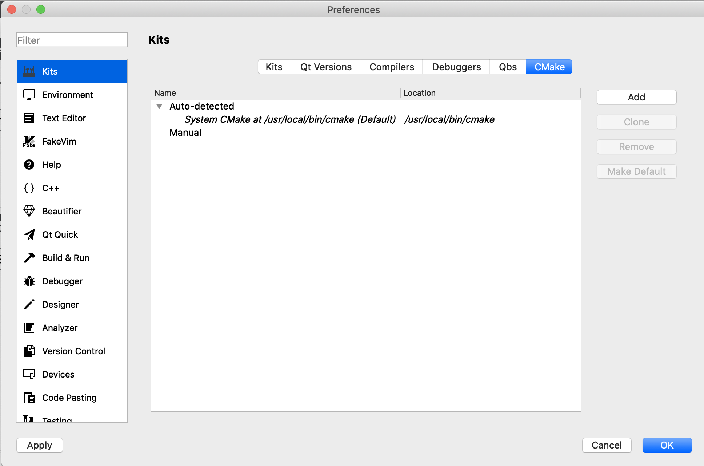
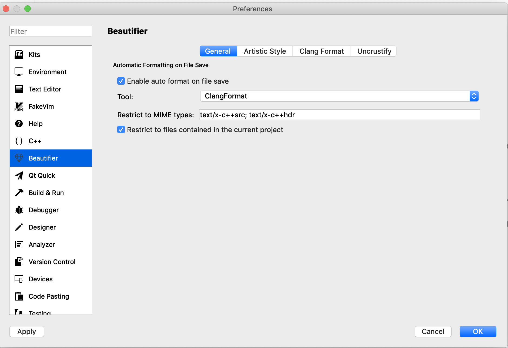
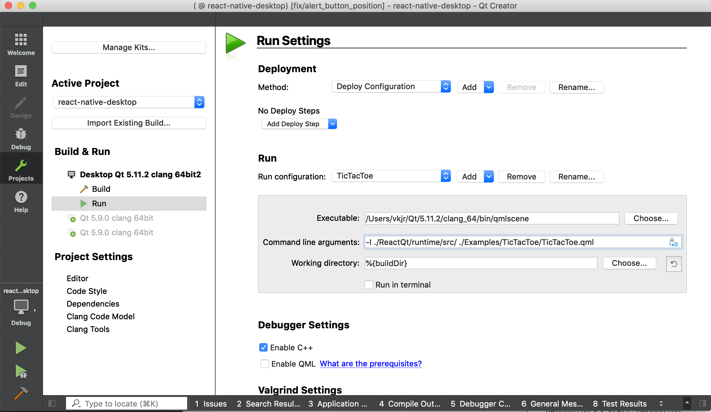

# Build, develop and debug native Qt modules of react-native-desktop with Qt Creator

### Prerequisites

Install prerequisites [from this document](InstallPrerequisites.md)
Check `Qt Creator` IDE during Qt installation to install it.

#### Install `clang-format`:
Version of `clang-format` should be 3.8

Mac: `brew install clang-format`

Windows: `choco install llvm` (llvm includes clang-format)

Ubuntu: `sudo apt install clang-format`


### Qt Creator cmake toolchain configuration

`Qt Creator` should be configured with path to CMake tool.  
Launch `Qt Creator`, select `Preferences`->`Kits`->`CMake` tab.
Make sure that `CMake` tool is auto-detected by `Qt Creator` or add one manually.


### Using clang-format for cpp code formatting
All cpp code in the project automatically formatted by clang-format. Formatting rules can be found in [react-native-desktop/ReactQt/.clang-format](https://github.com/status-im/react-native-desktop/blob/master/ReactQt/.clang-format)

#### Format with Qt Creator
Qt Creator automatically formats files when configured properly:

Tab `Preferences`->`Beautifier`->`General`.


Tab `Preferences`->`Beautifier`->`Clang Format`.


#### Format manually
Run [fix-formatting.sh](https://github.com/status-im/react-native-desktop/blob/master/fix-code-formatting.sh) to apply clang-format rules to the project code.

### Build react-native-desktop with Qt Creator

In `Qt Creator` select menu `File`->`Open File or Project...`.  
Navigate to the root directory of your `react-native-desktop` clone and select `CMakeList.txt` file to open.

Select Qt 5.11.2 toolchain to configure the project, if prompted.

By default, Qt configures `CMake` to do out-of-directory build on one level higher than your repo clone directory.

`Qt Creator` provides settings for `Build` and `Run` at the left side.

Select `Build` and under `Build Settings` select desired configuration - `Debug`, `Release` and others.  
To launch debug session we are interested in `Debug` configuration.  
Select `Debug` and start run of `CMake` tool by selecting `Build`->`Run CMake`.  

If `CMake` run finished without error, you can start the build `Build`->`Build All`. Check `Compile Output` tab for compilation results.

### Debugging and running of Examples with Qt Creator

**Note:** You need to start js server and bundler before you run the example.
To do this execute following commands in different terminals:
```sh
npm start #starts bundler
```
```sh
node ubuntu-server.js #starts js server
```

Like you do when [run your new app](CreateNewApp.md#run-the-project)


#### To run TicTacToe example.

1. Build and run `react-native-desktop` as described above
2. Open `Projects` tab in Qt Creator and select `Run` under `Build & Run` section of left pane
3. Add new `run configuration` for `Custom executable`, and name it `TicTacToe`.
4. Place path to qmlscene binary in `Executable` field: `/Users/USER_NAME/Qt/5.11.2/clang_64/bin/qmlscene`
5. In `command line arguments` set `-I ./ReactQt/runtime/src/ ./Examples/TicTacToe/TicTacToe.qml`
6. in `working directory` set `%{buildDir}`
7. Select `Build`->`Run` Qt Creator menu option to run TicTacToe example application.



#### To debug TicTacToe example.
To use debugger for step by step C++ code debugging when you finished configuring TicTacToe for run, select `Debug`->`Start Debugging`->`Start Debugging`

Debugger will be attached to started `qmlscene` process and you will able to break on your breakpoints in C++ source code.

#### Other examples
To run other examples you need to configure QtCreator similarly but with other path in `Command line arguments` field.
For example to Run/Debug RNTester use `-I ./ReactQt/runtime/src/ ../RNTester/qml/RNTester.qml`
