# How react-native-desktop works internally

## Desktop project code
When you create a project with `react-native init SomeProject`, you have ios and android-specific files generated immediately. To add desktop platform files, you have to invoke `react-native desktop` command (in your project folder). `SomeProject/desktop` folder generated then. It contains `CMakeLists.txt` for building desktop Qt application.

## Running the app

### Participants
There are 3 participants in react-native-desktop application:
- Qt application
- Bundler
- JS server (right now called ubuntu-server, but this is subject to change)

`Qt application` - built from a project in `desktop` folder. When runs it establishes communication with JS server and shows appropriate UI.

`Bundler` - this server runs on developer's machine and provides access to js files from the project. Also, it can generate "bundle" - single js file with all project code in it. Not needed for distribution.

`JS server` - provides a sandbox for running javascript project code. It communicates with Qt Application.

### Steps on app start




1. When `react-native run-desktop` invoked, `Qt application` is built and launched.

`desktop/main.cpp` is the file developer can change to affect app Qt app behavior. Other sources included from `node_modules/react-native/ReactQt/application/src`. If you depend on any 3rd party react-native modules, their code also included at this point.

2. `Qt application` connects to `Bundler` and receives single js file generated from all js files in a project.

This step is valid only for a development environment. For production you should manually generate js bundle, mention it in `package.json`, and it will be included in application resources.

3. `Qt application` connects to `JS server` and sends generated js code to it.
4. `JS server` invokes received javascript code in a sandbox, receives JSON response and sends it back to `Qt application`.
5. `Qt application` parses JSON response that contains instructions (what UI changes should be instantiated) and applies them. At this point, user see native desktop Qt application with the UI he described in original JS files.


### Communication when an app runs
`Qt application` and `JS server` maintain connection all the time. When a user clicks the button, `Qt application` constructs javascript code with information about an event and sends it to `JS server`. `JS server` evaluates code and returns JSON response that `Qt application` parses and reacts.


## Misc
Diagram code for future changes(mermaid format)

```
sequenceDiagram
QtApplication->>Bundler: Generate single js file from all js sources
Bundler-->>QtApplication: sends generated js file
QtApplication->>ubuntuserver.js: execute single js file in sandbox
ubuntuserver.js-->>ubuntuserver.js: executes js file
ubuntuserver.js->> QtApplication: send JSON response (result of code execution)
QtApplication-->> QtApplication: process JSON and instantiate UI components
```
