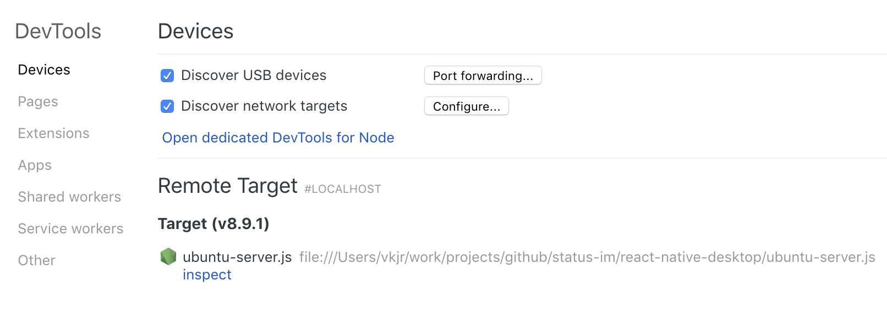
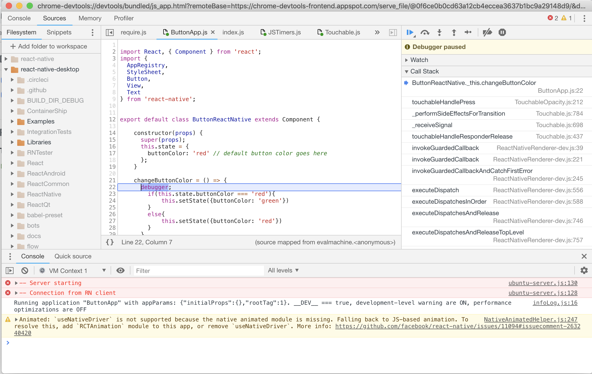

## Inspecting JS code

### Inspecting code

1) Run js server with `--inspect` switch:
```sh
node --inspect ubuntu-server.js
```

2) Run your `react-native-desktop` application

3) Open `chrome://inspect` page in a Chrome browser


4) Click on `inspect` link near `ubuntu-server.js` Target

5) Chrome devtools will open where you can see console output of your application and debug it.



### Inspecting UI

Read how to investigate UI structure [with `react-devtools`](https://github.com/facebook/react-devtools/blob/master/packages/react-devtools/README.md)
